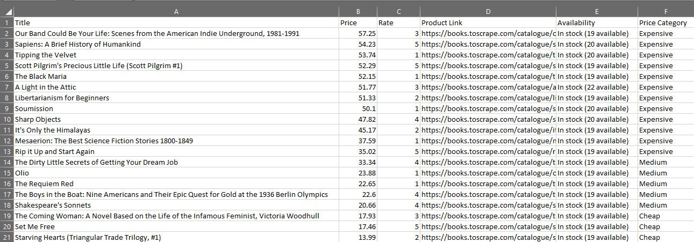

# Books Web Scraper

This Python project scrapes books data from the Books to Scrape website.

## Features

- Scrapes book title
- Scrapes price
- Extracts rating
- Collects product links
- Extracts availability
- Cleans data using pandas
- Saves data to CSV and Excel

## Technologies

- Python
- Requests
- BeautifulSoup
- Pandas

## How to run

Install requirements:

pip install -r requirements.txt

Run the script:

python main.py

## Example Output

